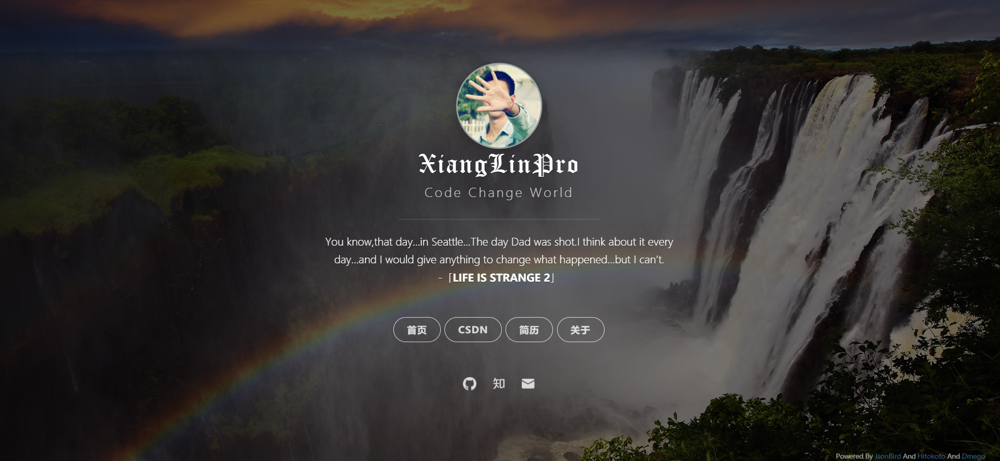

### 个人主页
>这是我的个人主页

>主要基于 [dmego](https://i.dmego.me/) 的个人主页进行修改，有兴趣的可以Fork一下~~

### 效果图

>静态图

### 更新时间

>2019-6-22

- 访问地址：[个人主页](https://blog.csdn.net/youif)
- 使用了 [一言](http://hitokoto.cn/) 的 API 服务

>2019-6-23
 
- 添加百度统计功能（可能需要5mins才会生效，耐心等待吧~~）
